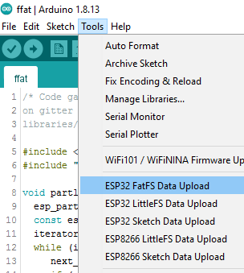

# arduino-esp32fatfs-plugin

***Please use the [universal combined plugin for all FS](https://github.com/lorol/arduino-esp32fs-plugin) instead of this one.***

## Arduino ESP32 FatFS filesystem uploader 

- Arduino plugin, which packs sketch **data** folder into FatFS filesystem image and uploads the image to ESP32 flash memory
- Identical to the [original one for SPIFFS](https://github.com/me-no-dev/arduino-esp32fs-plugin/)

## Notes for FatFS

- On Arduino IDE menu: *Tools > Partition Scheme* select one with FAT partition
- The usable size of FAT partition is reduced with 1 sector of 4096 bytes (0x1000) to resolve wear leveling space requirement
- For same reason, the image file is flashed with +4096 bytes (0x1000) offset of partition address csv table entry
- To flash the data folder as FAT partition by network port (uses espota), replace your esp32-core Update library with the [modified files here](https://github.com/lorol/arduino-esp32fatfs-plugin/tree/master/extra/esp32-modified-Update-lib-ffat-espota.zip)
- You may need to decrease **maxOpenFiles** at FFat.begin() of your sketch , [see this note](http://marc.merlins.org/perso/arduino/post_2019-03-30_Using-FatFS-FFat-on-ESP32-Flash-With-Arduino.html) 
>The FFAT module uses 8KB plus 4KB per concurrent file that can be opened. By default, it allows 10 files to be opened, which means it uses 48KB. IF you want to reduce its memory use, you can tell it to only support one file, and you will save 36KB, leaving you with only 12KB used.
```
if (!FFat.begin(0, "", 1)) die("Fat FS mount failed. Not enough RAM?");
```

## Installation

- Make sure you use one of the supported versions of Arduino IDE and have ESP32 core installed.
- Download the tool archive from [here](https://github.com/lorol/arduino-esp32fatfs-plugin/raw/master/src/bin/esp32fatfs.jar)
- In your Arduino sketchbook directory, create tools directory if it doesn't exist yet.
- Copy the tool into tools directory (the path will look like ```<home_dir>/Arduino/tools/ESP32FatFS/tool/esp32fatfs.jar```).
- You need an executable to create the image. See binary files for Windows and Linux (thanks @lbernstone for compiling) in the [extra folder](https://github.com/lorol/arduino-esp32fatfs-plugin/tree/master/extra) or take it from the author [here - mkfatfs tool](https://github.com/labplus-cn/mkfatfs/releases/tag/v1.0)  Thanks to [labplus-cn](https://github.com/labplus-cn/mkfatfs)
- Copy **mkfatfs[.exe]** to **/tools** folder of esp32 platform where **espota** and **esptool** (.py or.exe) tools are located
- You can modify it and rebuild to use other fatfs image-creating tools, like [ESP32_fatfsimage](https://github.com/marcmerlin/esp32_fatfsimage)  w/ binary for Linux, you need to change the parameters example size is /1024
- Restart Arduino IDE. 

## Usage

- Open a sketch (or create a new one and save it).
- Go to sketch directory (choose Sketch > Show Sketch Folder).
- Create a directory named `data` and any files you want in the file system there.
- Make sure you have selected a board, partition scheme with FAT, port, and closed Serial Monitor.
- Select *Tools > ESP32 FatFS Data Upload* menu item. This should start uploading the files into ESP32 flash file system.

  When done, IDE status bar will display FatFS Image Uploaded message. Might take a few minutes for large file system sizes.
  
## Screenshot



## Credits and license

- This work is based on the [original tool](https://github.com/me-no-dev/arduino-esp32fs-plugin/ ) Copyright (c) 2015 Hristo Gochkov (hristo at espressif dot com)
- Licensed under GPL v2 ([text](LICENSE))

## Quick build on Win:

- Install Java JDK 
- Find the path of javac.exe and jar.exe
- Edit make_win.bat accordingly
- Copy files **arduino-core.jar , commons-codec-1.7.jar , pde.jar**  from your Arduino IDE installation to the folder where is located **make_win.bat**
- Run **make_win.bat**
- Find the **build jar** in /bin directory 
